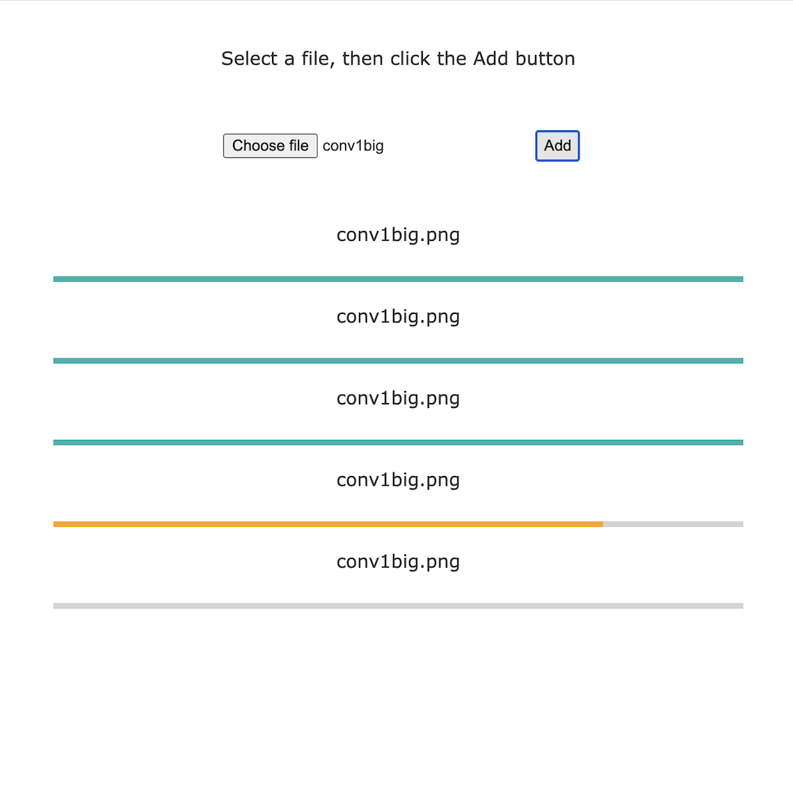

# MC Task

visit https://mc-task.web.app/ to see this app deployed

to run the app locally run `yarn && yarn start`

then select a file and click the `Add` button afterwards

# Firebase

Steps required to deploy with firebase:

- `yarn build`
- `cp dist/\* out/`
- `node_modules/.bin/firebase deploy --only hosting`

these three commands are called sequentially when running `yarn firebase-deploy`

To simulate a deployment and host the app locally run `yarn firebase-emul`
